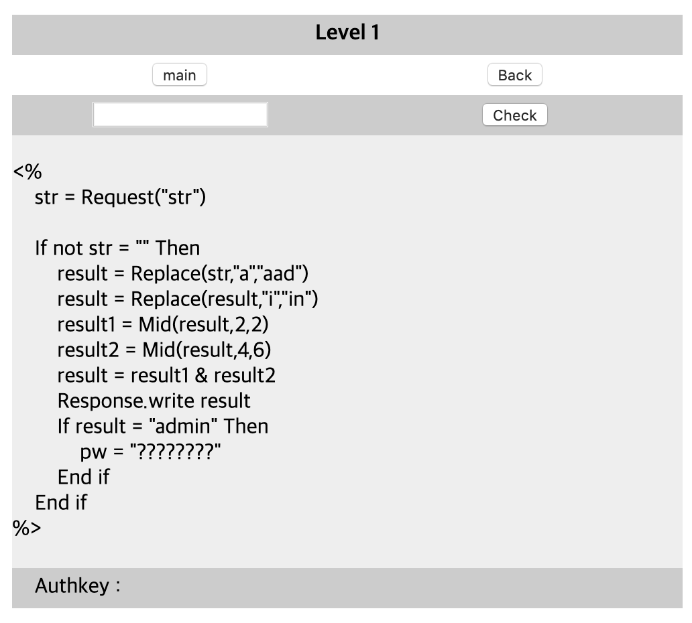

# [WEB] 1


### 초기화면

ASP 문서임을 알 수 있음

---
### 풀이
>Replace(string , 변경할 문자열 패턴, 새로운 문자열)
: 문자열 치환 함수

>Mid(string, 반환을 시작하는 문자위치, 반환 문자 개수)
: 문자열에서 지정한 개수의 문자 반환

>& : asp에서는 문자열을 &로 합침

```asp
If result = "admin" Then
    pw = "?????????"
End if
```
이부분에서 result는 최종값이 "admin"이라는 것을 알 수 있고 역추적해서 초기 입력값을 도출한다.
```
result1 = Mid(result,2,2)
result2 = Mid(result,4,6)
```
이부분에서 result를 ?OOXXXXXX??? 이라고 한다면 result1이 OO==ad, result2가 XXXXXX==min이다.

```
result = Replace(str,"a","aad")
result = Replace(result,"i","in")
```
이 코드의 결과로 반환될 result는 "?admin"이 나와야 한다. 그러므로 2행의 반환전 result는 "?admi". 1행의 str은 ami여야 한다.

---
입력창에 ami를 입력하면 인증키가 나온다.

