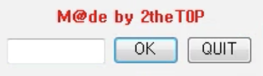
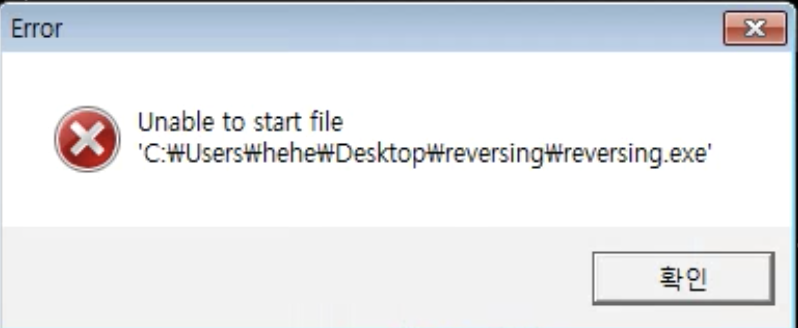
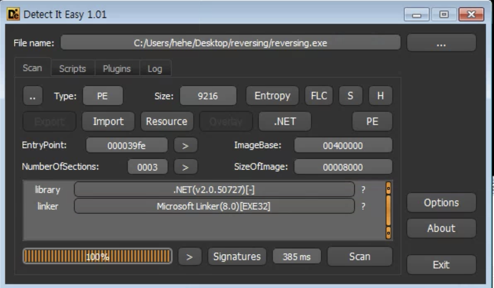
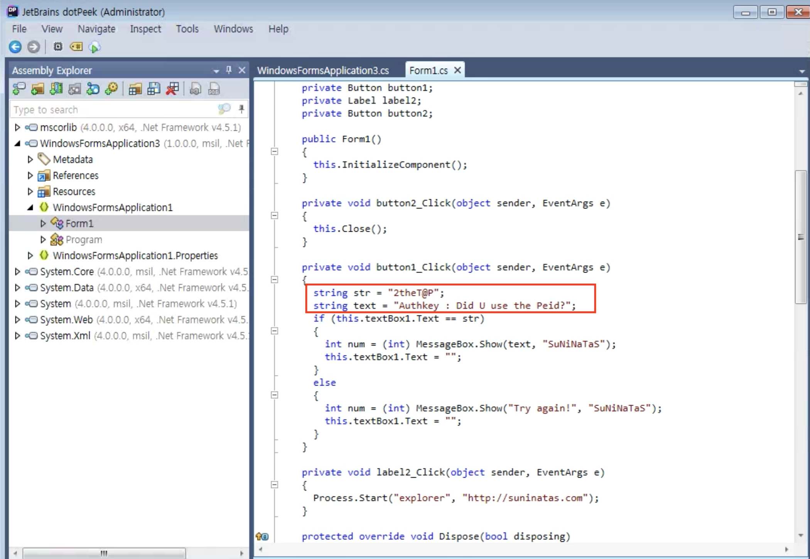
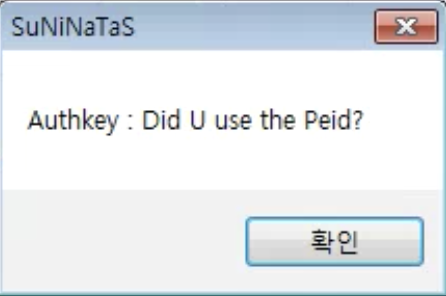

# [Reversing] 10

### 초기화면

---
### 풀이

그냥 바로 올리디버거에 올려본다.. 그런데 에러가 뜬다!!!

DIE로 파일의 정보를 파악한다. 닷넷프로그램인 것을 알 수있다.

dotPeek이라는 닷넷 디컴파일러를 돌려서 살펴본다. 그러면 그냥 키랑 인증키가 하드코딩 된것을 볼 수 있다.

---

키를 입력해보면 Authkey가 뜬다.

---