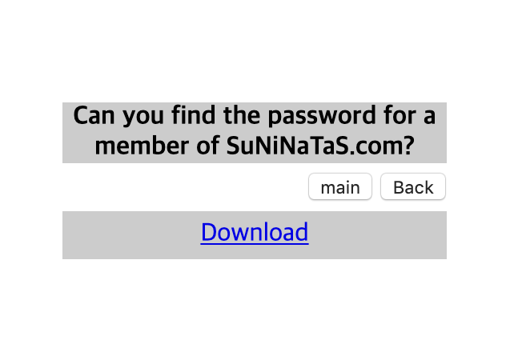
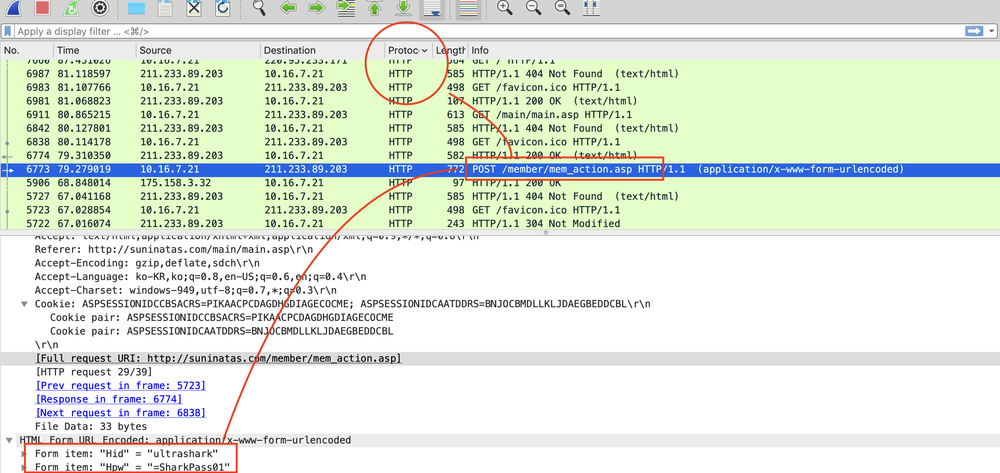
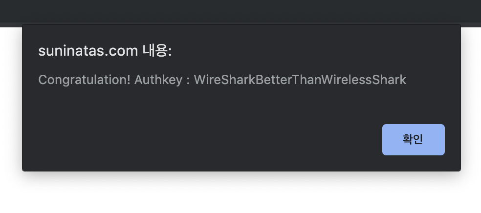

# [SYSTEM] 16

### 초기화면
</img>

서니나타스 회원의 비밀번호를 찾을 수 있냐는 질문과 함께 다운로드가 있다.
초기화면에서 다운로드를 해보면 패킷덤프가 다운되는 것을 알 수 있다.

---

### 풀이

와이어샤크로 바로 열어서 본다. 
취약한 웹페이지라면 form에서 입력받은 id, pw인자가 http프로토콜을 통한 패킷에 그대로 드러난다. 

와이어샤크에서 protocol을 정렬시키고 http 부분을 확인한다. 
GET, HTTP, POST 등이 있지만 쭉 살펴보면 `POST /member/mem_action.asp ~~ ` 패킷을 확인할 수 있다. 

이 패킷을 자세히 보면 id와 pw가 노출되어 있음을 알  수 있다. 

이게 답은 아니다.
여러개의 이런 패킷이 있는데 이 정보들로 서니나타스에 로그인을 시도해보면 답을 찾을 수 있다.

---

로그인에 성공을 하면 authkey를 알려주는 alert창이 뜬다.