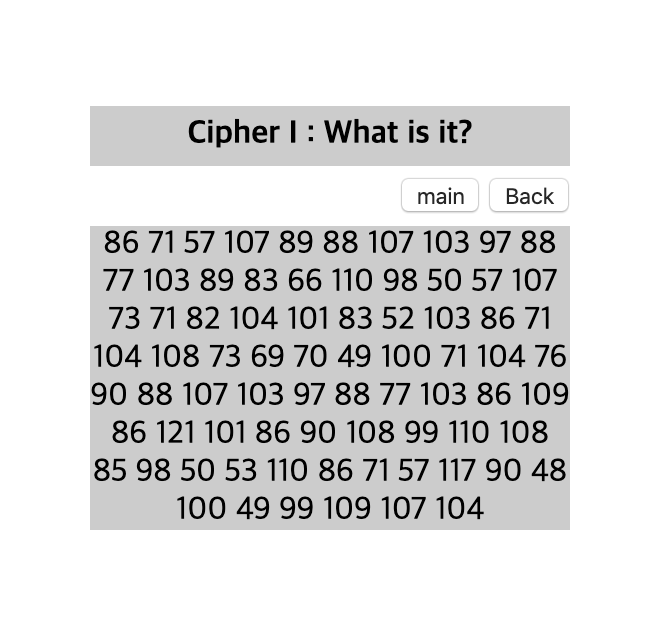
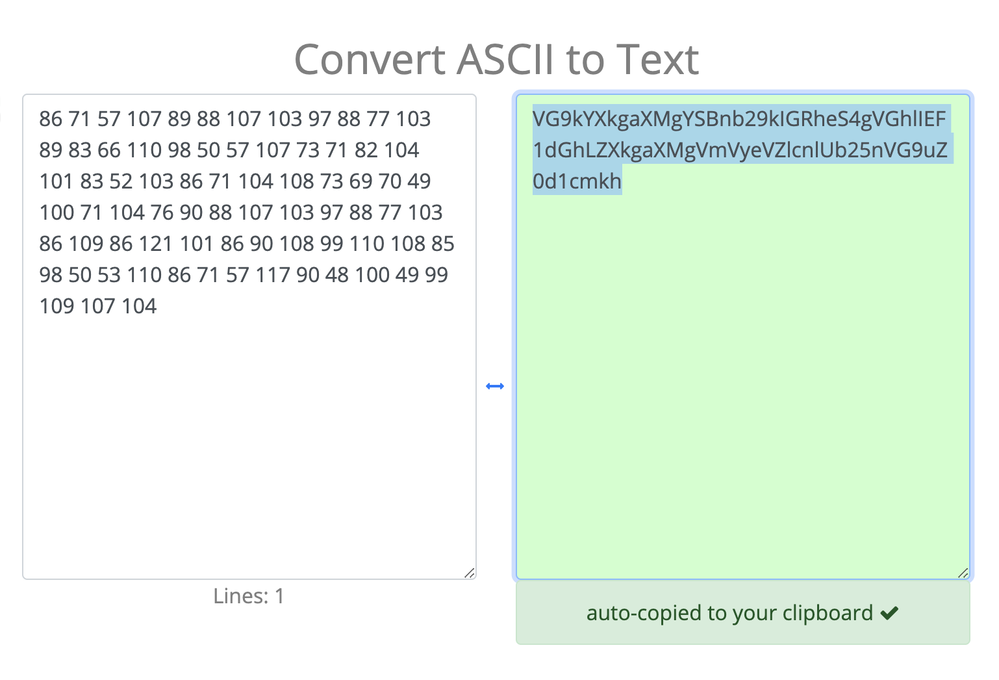
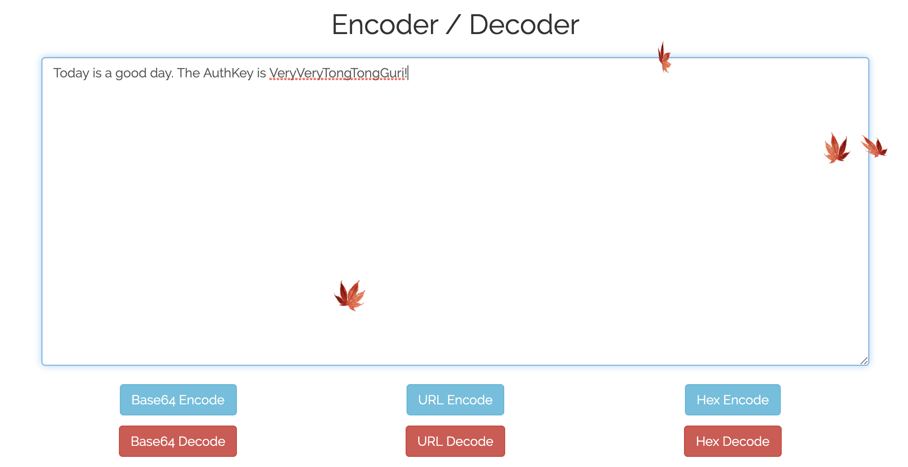

# [FORENSIC] 18

### 초기화면

암호해독 문제

숫자들이 나열되어있다..
잘 살펴보면 특정 범위를 넘어서지 않는다..아스키코드 문자,숫자범위를..

---
### 풀이

아스키코드를 문자로 변환해본다. 더 이상한 문자열이 나왔다.

---

서니나타스 페이지에 툴 부분에 디코더가 있다. Base64로 디코딩해보면 authkey

---