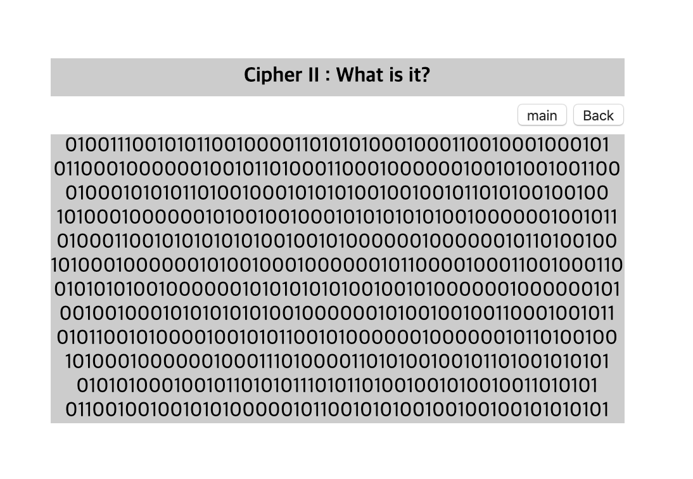
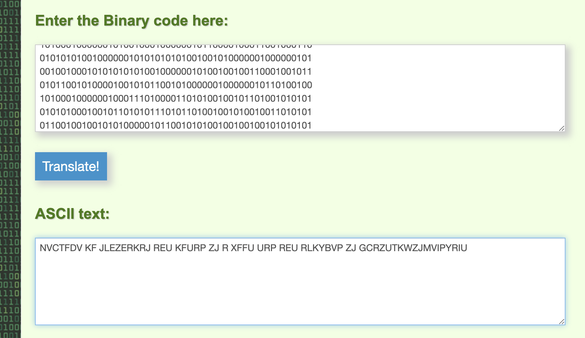
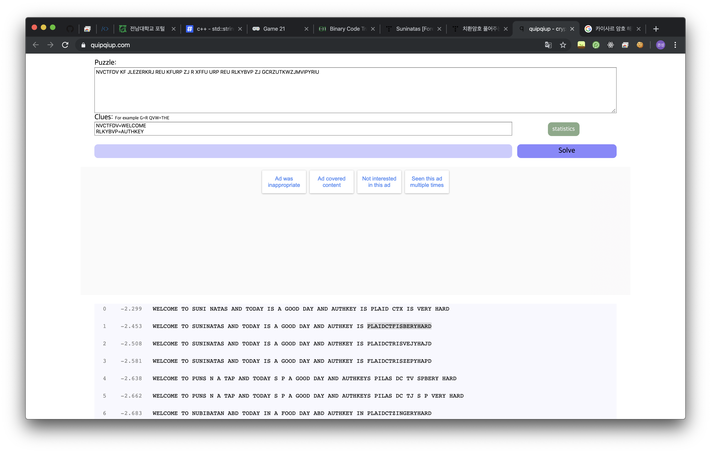

# [FORENSIC] 19

### 초기화면

암호해독 문제

숫자들이 나열되어있다..
바이너리 값인것 같다.

---
### 풀이

아스키로 변환해보면 더 이상한 문자열이 나온다. 전부 대문자에 공백이 포함..
구글링해보면 시저암호 즉 치환암호처럼 보인다.

>#### 시저암호
>
>
>치환암호의 일종으로 특정 키값만큼 알파벳을 이동시켜 다른 알파벳으로 치환하는 암호화 방식.

---

quipquip.com 이라는 페이지에서 해독이 가능하다..

`WELCOME TO SUNINATAS AND TODAY IS A GOOD DAY AND AUTHEKY IS PLAIDCTFISVERYHARD`

---