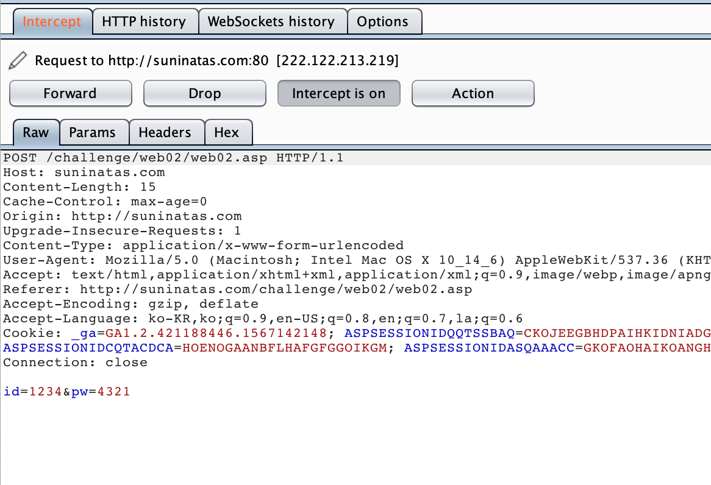

# 1주차
#### 152987 이권성
---
## [WEB] 1


### 초기화면

ASP 문서임을 알 수 있음

---
### 풀이
>Replace(string , 변경할 문자열 패턴, 새로운 문자열)
: 문자열 치환 함수

>Mid(string, 반환을 시작하는 문자위치, 반환 문자 개수)
: 문자열에서 지정한 개수의 문자 반환

>& : asp에서는 문자열을 &로 합침

```asp
If result = "admin" Then
    pw = "?????????"
End if
```
이부분에서 result는 최종값이 "admin"이라는 것을 알 수 있고 역추적해서 초기 입력값을 도출한다.
```
result1 = Mid(result,2,2)
result2 = Mid(result,4,6)
```
이부분에서 result를 ?OOXXXXXX??? 이라고 한다면 result1이 OO==ad, result2가 XXXXXX==min이다.

```
result = Replace(str,"a","aad")
result = Replace(result,"i","in")
```
이 코드의 결과로 반환될 result는 "?admin"이 나와야 한다. 그러므로 2행의 반환전 result는 "?admi". 1행의 str은 ami여야 한다.

---
입력창에 ami를 입력하면 인증키가 나온다.


---
---
## [WEB] 2

### 초기화면


---
### 풀이

페이지의 소스코드를 보면 스크립트에서 id와 pw가 같으면 alert가 뜨는 것을 알 수있다. 
그리고 주석에서 힌트로 Join / id = pw를 확인할 수 있다.
id = pw 인걸 보면 alert가 안 뜨게 우회해야 할 것 같은 생각이 든다.



일단 id와 pw를 다르게 하여 버프스위트로 request를 intercept해준다.


pw 값을 id와 같게 값을 바꿔주고 forward를 진행한다.

---


웹페이지 창으로 돌아가 보면 authkey가 나타남을 알 수 있다.

---
---
## [WEB] 3

### 초기화면


---
### 풀이

Notice Board에 글을 쓰라는 문제이다. Notice는 글을 쓸 수가 없는 페이지이다.


url에 suninatas.com/board/notice 부분에 /write 를 추가해보면
 
글을 쓸수 있는 페이지로 이동한다. 

---

글을 써서 sumit을 하면 authkey를 확인할 수 있다.


---
---


## [SYSTEM] 16

### 초기화면
</img>

서니나타스 회원의 비밀번호를 찾을 수 있냐는 질문과 함께 다운로드가 있다.
초기화면에서 다운로드를 해보면 패킷덤프가 다운되는 것을 알 수 있다.

---

### 풀이


와이어샤크로 바로 열어서 본다. 
취약한 웹페이지라면 form에서 입력받은 id, pw인자가 http프로토콜을 통한 패킷에 그대로 드러난다. 


와이어샤크에서 protocol을 정렬시키고 http 부분을 확인한다. 
GET, HTTP, POST 등이 있지만 쭉 살펴보면 `POST /member/mem_action.asp ~~ ` 패킷을 확인할 수 있다. 

이 패킷을 자세히 보면 id와 pw가 노출되어 있음을 알  수 있다. 

이게 답은 아니다.
여러개의 이런 패킷이 있는데 이 정보들로 서니나타스에 로그인을 시도해보면 답을 찾을 수 있다.


---


로그인에 성공을 하면 authkey를 알려주는 alert창이 뜬다.


---
---
---

### 2019.09.26

- 지난 일주일 간의 성과
    - 웹 3문제
        - 1번 : 소스코드 분석
        - 2번 : 버프스위트를 활용하여 값 변조
        - 3번 : url로 페이지 이동
    - 시스템 1문제
        - 16번 : 와이어샤크를 활용한 기초적인 패킷 분석

- 어려웠던 점
쉬운것만 풀어서 딱히..

- 이번주에 하고자 하는 것
    - 웹, SQL 인젝션 문제들을 공부할 생각..
    - misc