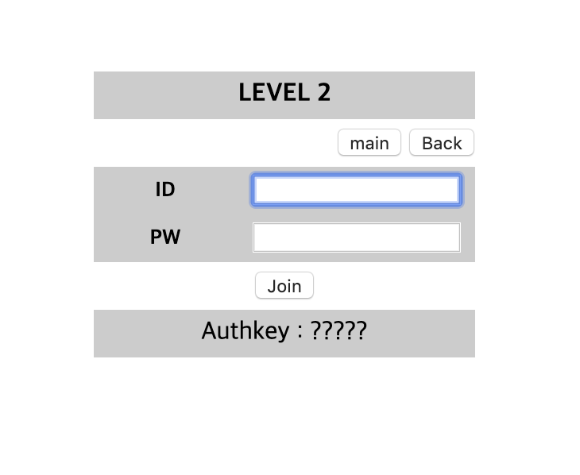
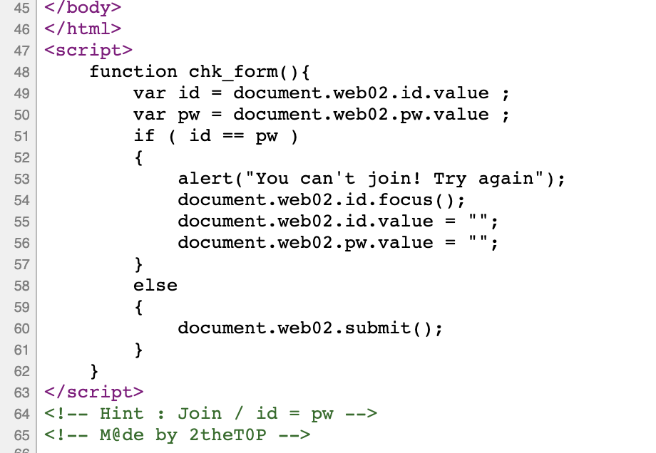

# [WEB] 2

### 초기화면

---
### 풀이

페이지의 소스코드를 보면 스크립트에서 id와 pw가 같으면 alert가 뜨는 것을 알 수있다. 
그리고 주석에서 힌트로 Join / id = pw를 확인할 수 있다.
id = pw 인걸 보면 alert가 안 뜨게 우회해야 할 것 같은 생각이 든다.

일단 id와 pw를 다르게 하여 버프스위트로 request를 intercept해준다.

pw 값을 id와 같게 값을 바꿔주고 forward를 진행한다.

---

웹페이지 창으로 돌아가 보면 authkey가 나타남을 알 수 있다.

---