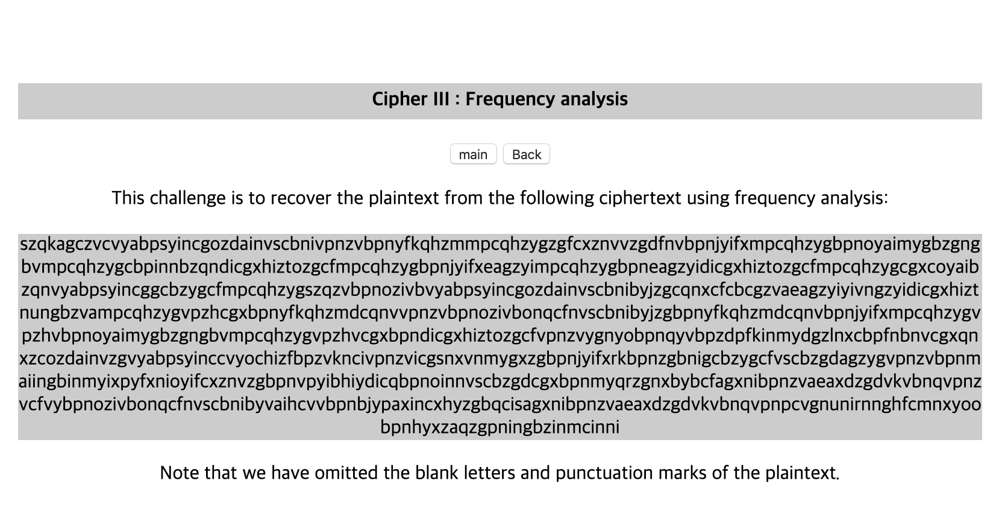

# [FORENSIC] 26

### 초기화면

암호해독 문제

빈도분석을 통해서 해독하라고 한다.

---
### 풀이
quipquip.com 에서 돌리면 된다.

>#### 빈도분석 복호화
>간단한 치환암호의 경우 암호문의 알파벳별 빈도수와 복호화문의 알파벳별 빈도수가 같다. 이 사실을 기반으로 분석을 통해 해독하는 방법

---

```
kim yuna is a south korean figure skater she is the olympic champion in ladies singles the world champion the four continents champion a three time grand prix final champion the world junior champion the junior grand prix final champion and a four time south korean national champion kim is the first south korean figure skater to win a medal at an isu junior or senior grand prix event is u championship and the olympic games she is the first female skater to win the olympic games the world championships the four continents championships and the grand prix finals he is one of the most highly recognized athletes and media figures in south korea as of april this years he is ranked second in the world by the international skating union she is the current record holder for ladies in the short program the free skating and the combined total under the isu judging systems he is also the first female skater to surpass the two hud read point mark under the isu judging systems he has never been placed off the podium in her entire career
```
사실 해독을 해도 authkey라고 명시된 뭐가 없다. 그래서 kimyuna를 쳐보면 authkey

---