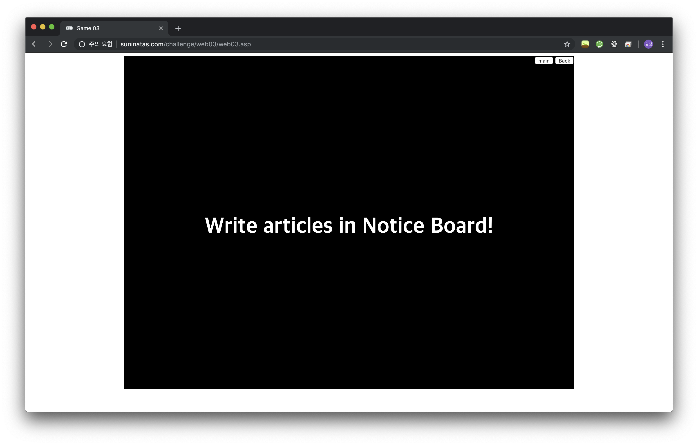
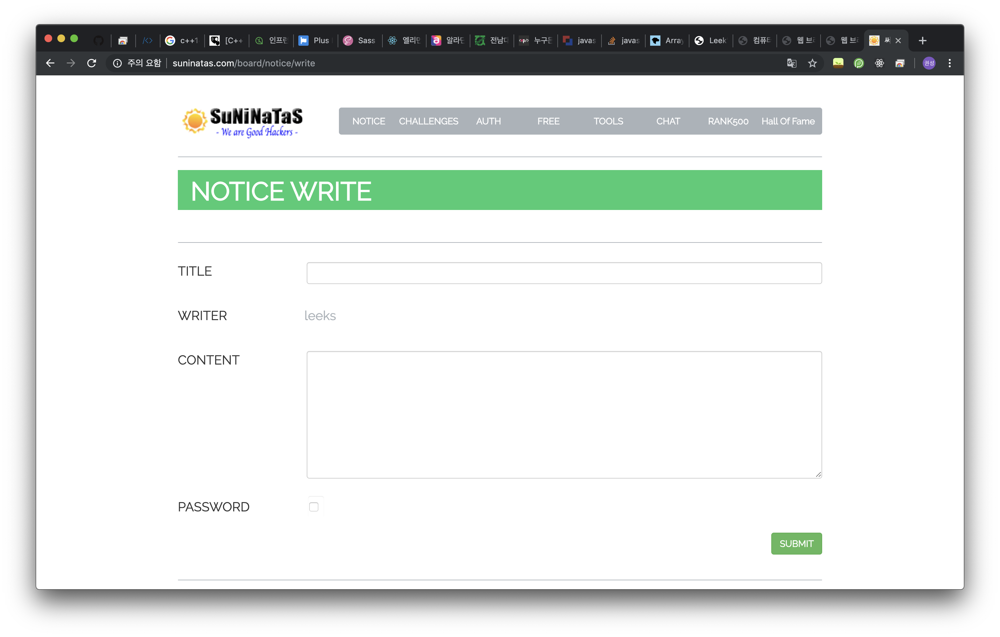

# [WEB] 3

### 초기화면

---
### 풀이

Notice Board에 글을 쓰라는 문제이다. Notice는 글을 쓸 수가 없는 페이지이다.

url에 suninatas.com/board/notice 부분에 /write 를 추가해보면
 
글을 쓸수 있는 페이지로 이동한다. 

---

글을 써서 sumit을 하면 authkey를 확인할 수 있다.

