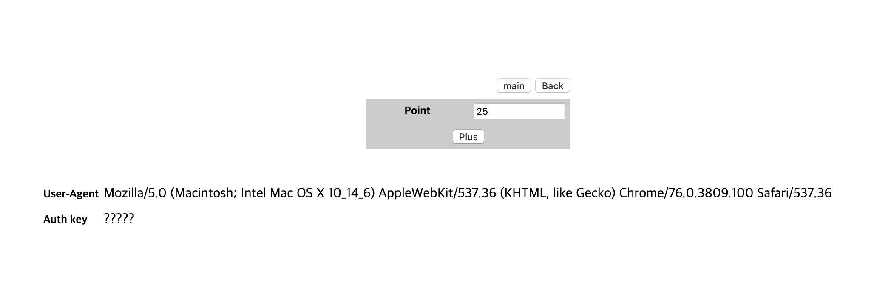
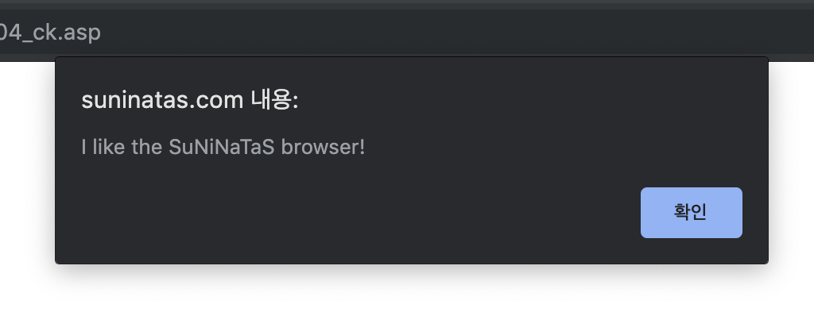
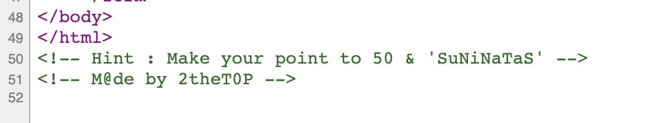
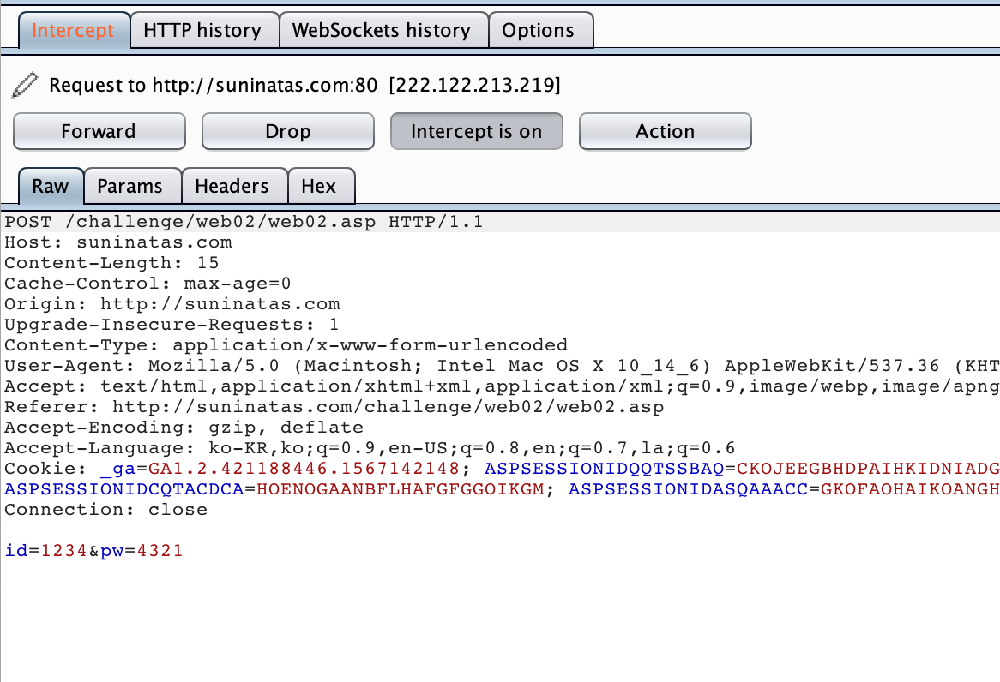
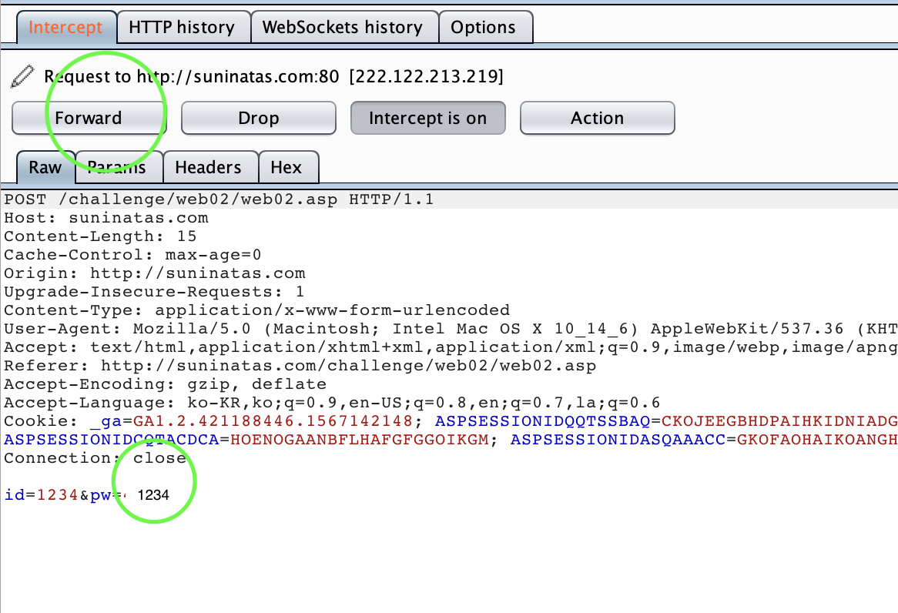
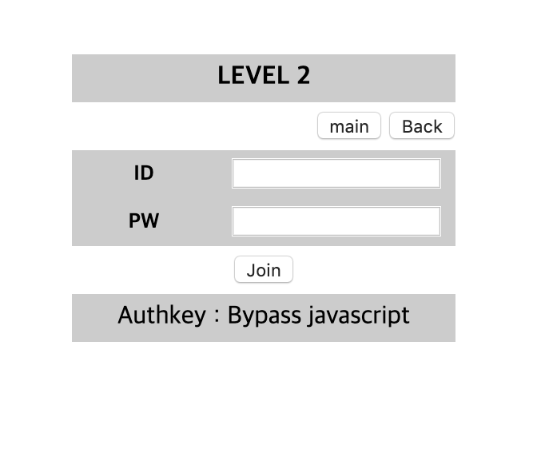

# [WEB] 4

### 초기화면

plus버튼을 계속 눌러서 25를 만들면 경고창이 뜬다

---
### 풀이

페이지 소스코드에는 특별한 코드는 없고 힌트를 보면 점수를 50으로만들고 User-Agent값도 suninatas로 바꿔야 하는 듯..

일단 id와 pw를 다르게 하여 버프스위트로 request를 intercept해준다.

pw 값을 id와 같게 값을 바꿔주고 forward를 진행한다.

---

웹페이지 창으로 돌아가 보면 authkey가 나타남을 알 수 있다.

---