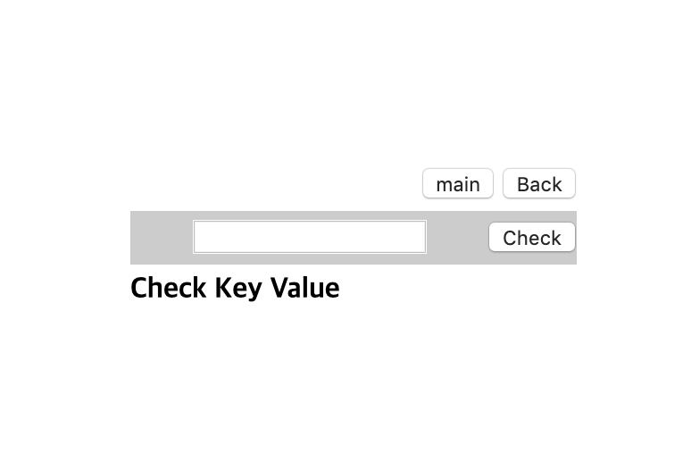
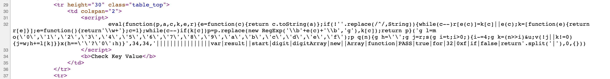
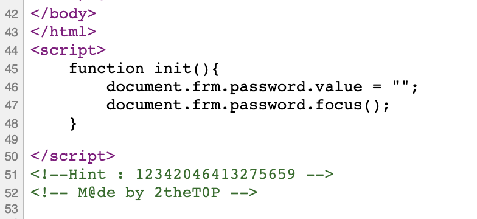
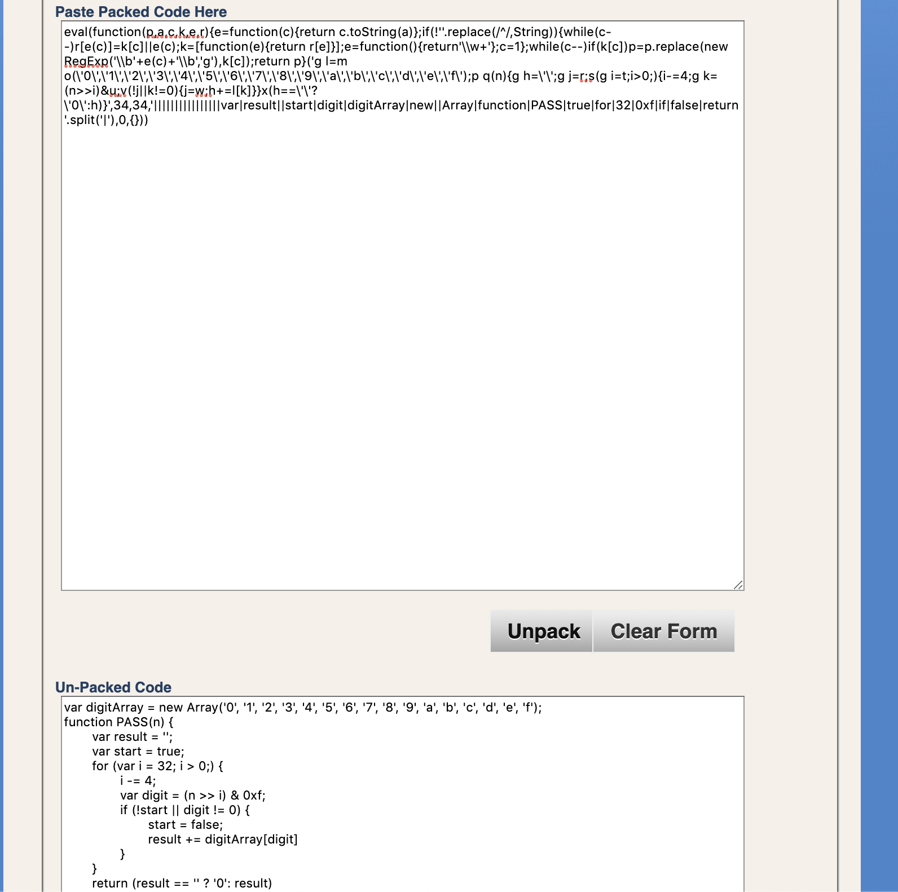
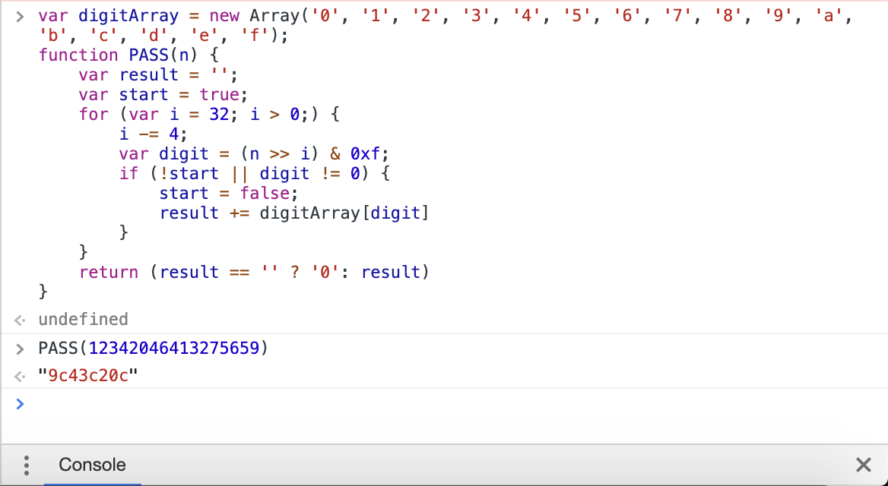
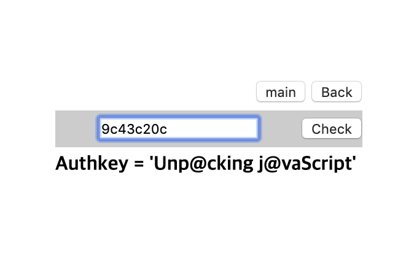

# [WEB] 5

### 초기화면


---
### 풀이
소스코드를 살펴보면 다음과 같은 스크립트가 삽입되어 있음을 알 수 있다. 

기괴한 자바스크립트 코드이다..

`eval(function(p,a,c,k,e,r)` 이 부분에서 난독화 자바스크립트 코드라는 것을 확인할 수 있다.

초기화 하는 함수와 힌트가 있다.


난독화 unpack하는 사이트에서 난독화 unpack을 진행하면 밑에와 같은 코드임을 알 수 있다.
```javascript
var digitArray = new Array('0', '1', '2', '3', '4', '5', '6', '7', '8', '9', 'a', 'b', 'c', 'd', 'e', 'f');
function PASS(n) {
	var result = '';
	var start = true;
	for (var i = 32; i > 0;) {
		i -= 4;
		var digit = (n >> i) & 0xf;
		if (!start || digit != 0) {
			start = false;
			result += digitArray[digit]
		}
	}
	return (result == '' ? '0': result)
}
```

콘솔에 이 코드를 아까의 힌트 숫자와 같이 실행시키면


키 값이 나오고

---
이 키를 초기화면 창에 입력하면 답!!
