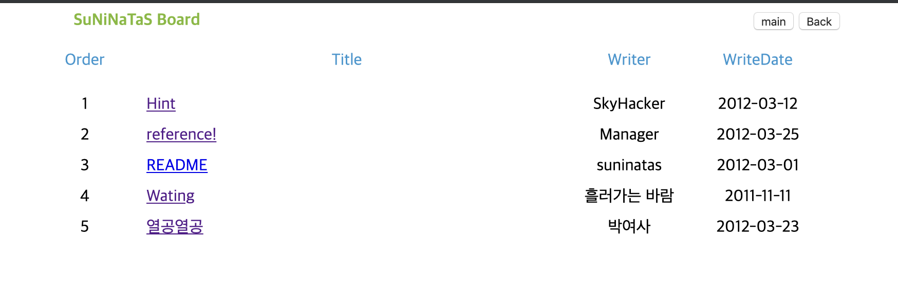
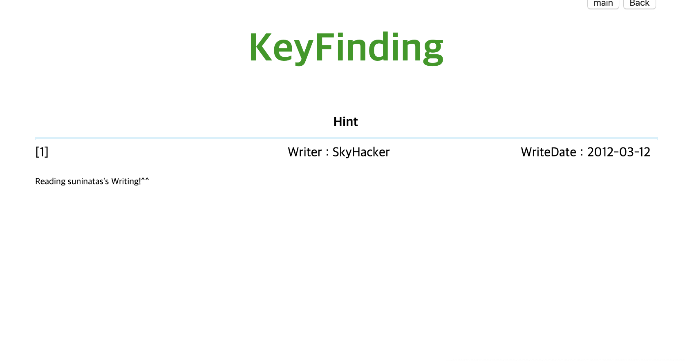
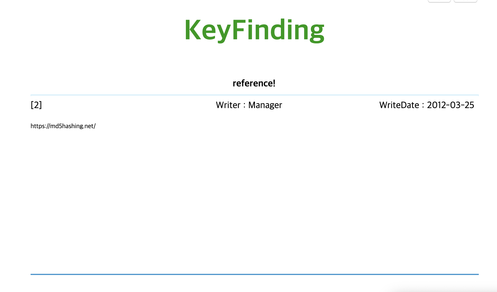
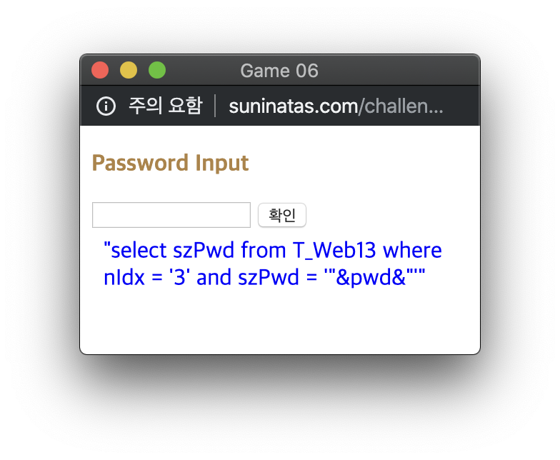
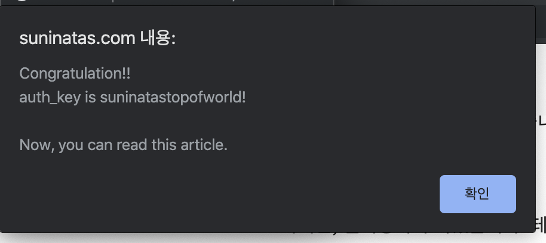
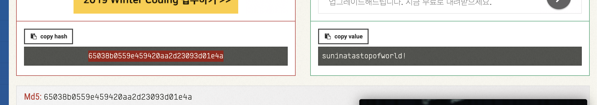
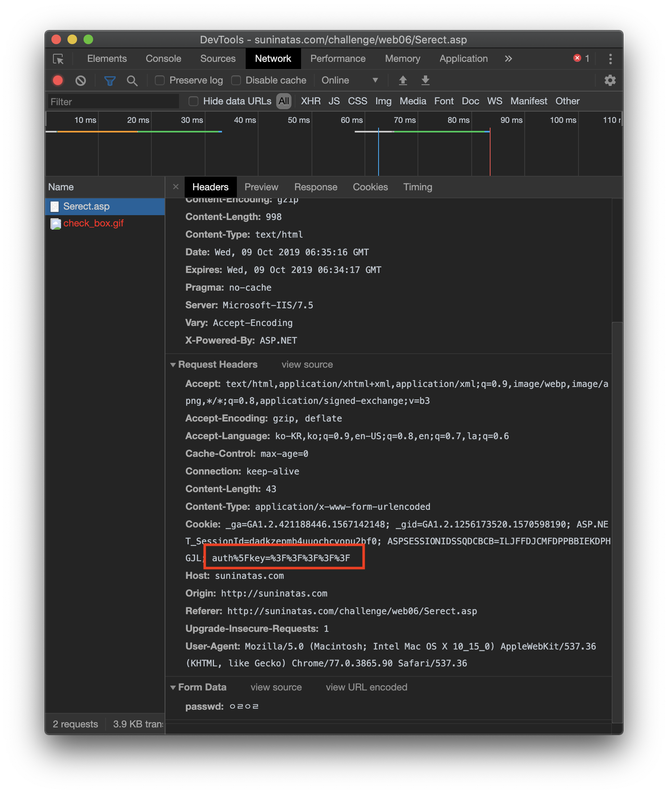
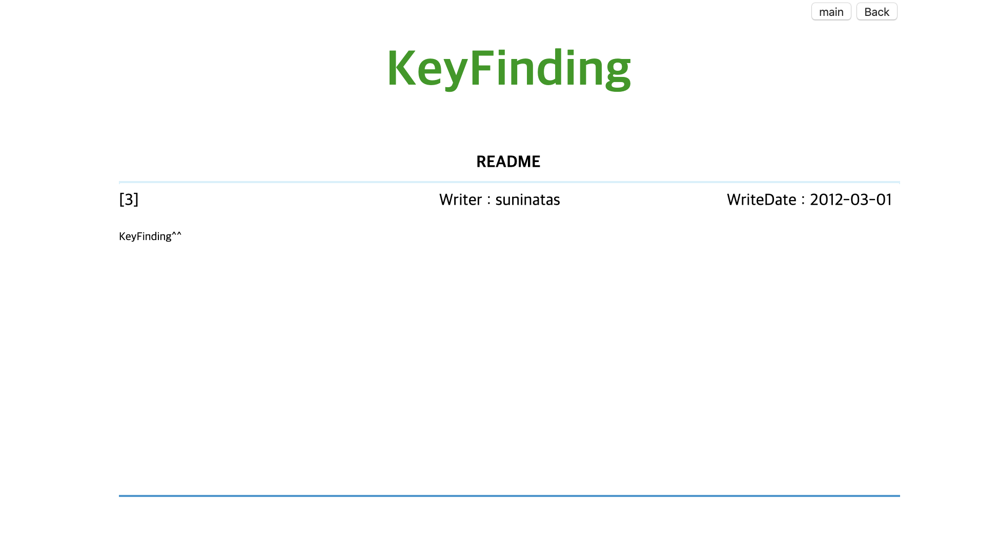
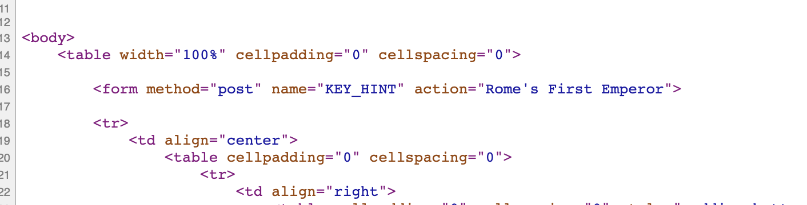

# [WEB] 6

### 초기화면
 

위 그림같은 게시판이 나타난다.. 하나씩 들어가 보면
첫번째 Hint는


3번 게시물 README를 읽어 보라는 것


md5hashing인 것을 보아 뭔가 암호화,복호화하는게 문제풀이시 필요한 듯하다.


암호를 입력하라는 창이다.

```sql
select szPwd 
from T_Web13 
where nIdx = '3' and szPwd = '"&pwd&"'
```

전형적인 sql 구문이 쓰여있다. T_Web13 테이블에서 nIdx가 3인 패스워트를 선택하는 구문이다. 입력창에 입력한 값이 "&pwd&"에 들어가는 듯..

나머지 페이지는 열심히 하라는 조언들?!


---
### 풀이
README 페이지에서 SQL인젝션을 진행하여 뚫으면 되지 않을까하고 시도를 한다.
구문이 항상 참이 되는 값들을 입력해 본다.
|SQL인젝션 구문|
---
|' or 1=1 --'|
|' or 1=1 --|
|' or '1'='1'|
|' or 2>1 --|
|' or ''='|
|' or 1=1;--|
|' or 1=1#|
싱글쿼터로 명령을 끝내고 참인 구문과 주석처리문을 써놓는 구문들이다. 이들은 DB별로 다양한 방식으로 처리해야 한다. 

이외에도 UNION 명령을 이용한 방법이나 다양한 SQL명령 조합으로 db정보들을 노출시키는 방법이 있다. 그러나 이런 명령이나 특수문자들에 대해서 필터링을 하기 때문에 다양한 시도를 통해 뚫리는 방법을 찾아내야 한다.

DB별 주석 처리

|DB|주석처리|
|---|---|
|MySQL|#|
|MSSQL|--|
|Oracle|--|
|MariaDB|--,#|

여기에서는 ' = ' 이 막혀있는듯 하여 

`1' or '2' > '1' --`  이렇게 입력을 해보면

 창이 뜬다. 
authkey가 sunniatastopofworld!라고 한다. 그 이후에 접근권한이 없다는 창과 함꼐 창이 닫힌다.

이 authkey를 입력해도 페이지에 접근할 수는 없다. 이 떄 필요한 것이 아까의 레퍼런스 페이지.. authkey를 해싱해야겠다.

그러면 
`65038b0559e459420aa2d23093d01e4a`의 값을 얻는다. 이 값을 입력창에 입력해도 안된다. 그러면 이 값을 어떻게 활용할 것인가..



입력창에서 개발자도구를 열어서 request를 살펴 보면 쿠키값에 authkey가 있다는 것을 알 수 있다. %3f%3f%3f%3f%3f 이런 값이 있는데 %3f는 URL인코딩으로 ?라고 한다. 이 부분의 값을 변조한다. 구글에서 검색해서 쿠키변조 툴을 사용한다.

그럼 다음과 같은 창이 나온다.


아무것도 없는데 페이지 소스를 보면 딱!!

---


로마의 첫번째 황제가 키라고 한다.