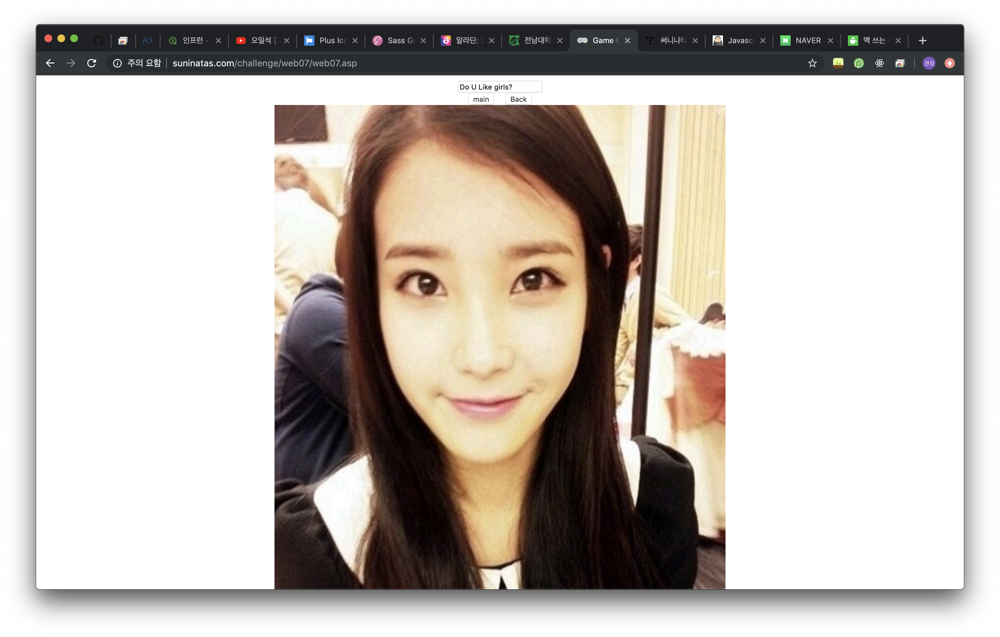
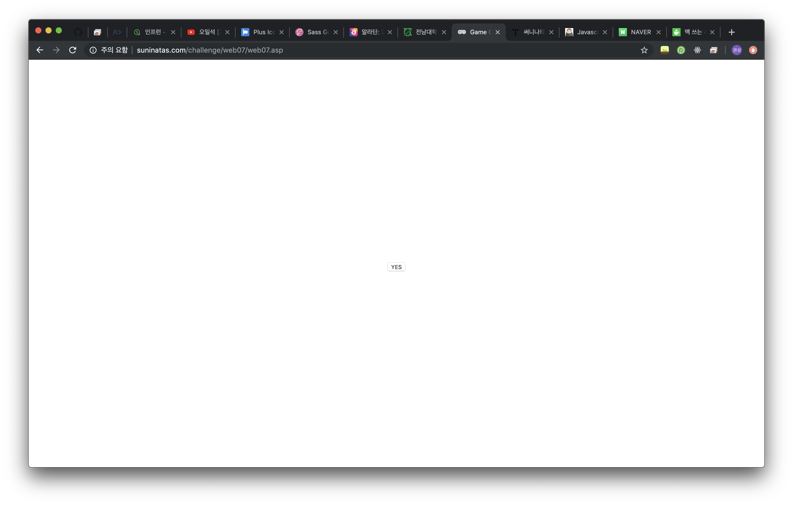
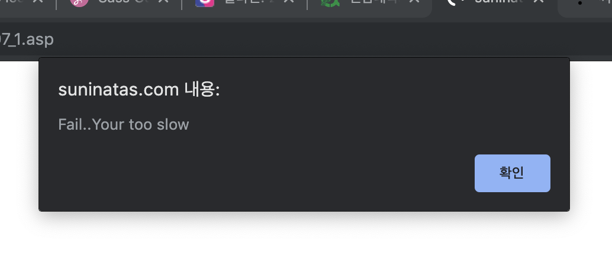
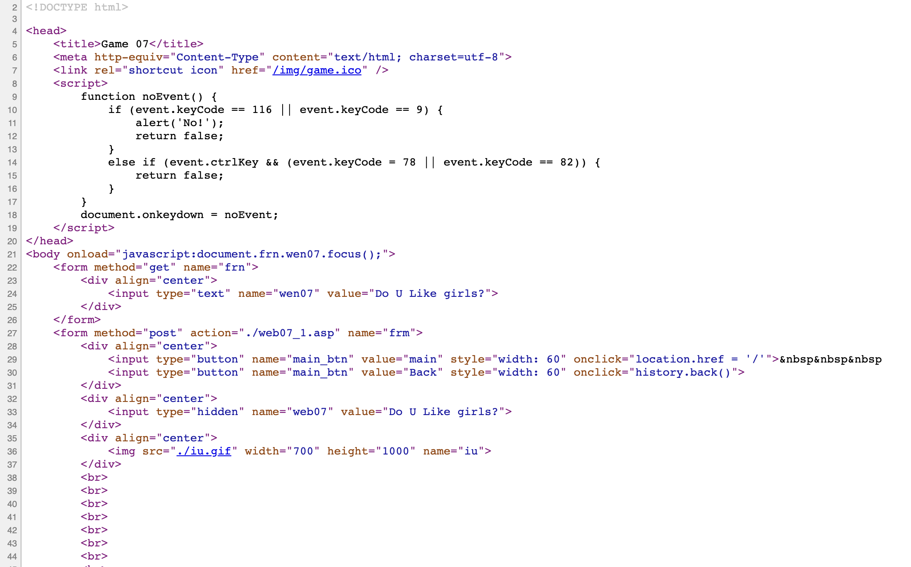
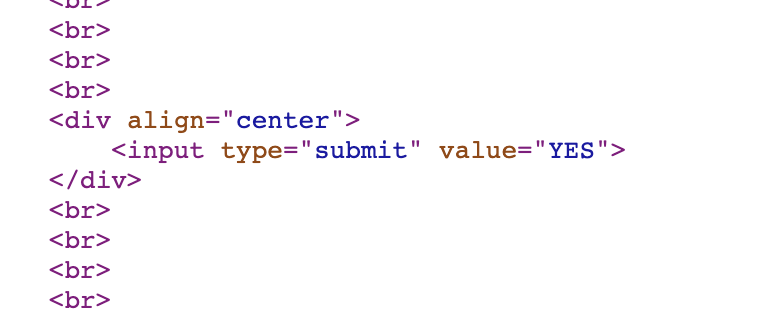
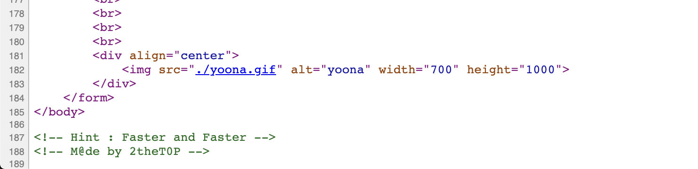
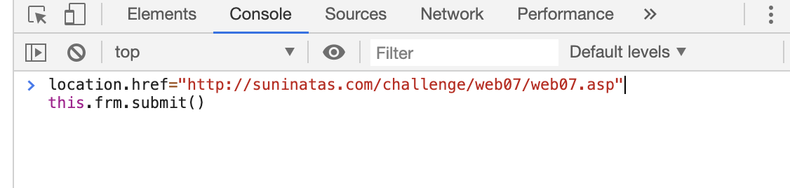
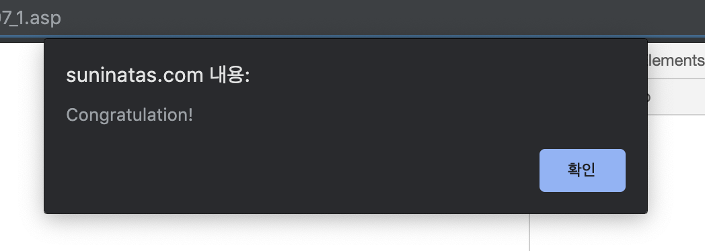
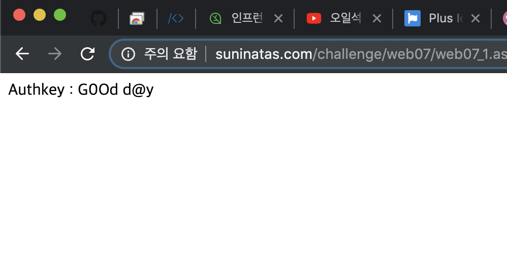

# [WEB] 7

### 초기화면

처음에 아이유 화면이 있고

스크롤을 쭉 내리면 yes 버튼이 있다.

버튼을 눌러 보면 alert창이 뜬다..느리다고 한다.
그 밑에는 윤아의 사진이 있다.

---
### 풀이

소스코드를 살펴 보면 스크립트에 함수가 있는 것을 볼 수 있다. 특정 키코드의 키를 누르면 false가 리턴되도록 하는 함수이다. 

f5키 혹은 tab키를 누르면 'NO'라는 alert가 뜨고

ctrl+n 혹은 ctrl+q를 누르면 false 반환.. 


yes 버튼 누르면 submit되는 폼이 있고

마지막에 힌트가 있다..결국 submit 버튼을 빨리 눌러야 하는 문제

콘솔에서 바로 이 페이지의 frm폼의 submit객체를 바로 호출한다.

그럼 성공

---

웹페이지 창으로 돌아가 보면 authkey가 나타남을 알 수 있다.

---